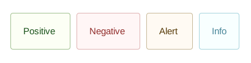
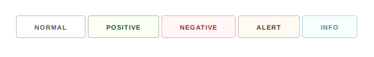
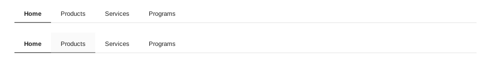
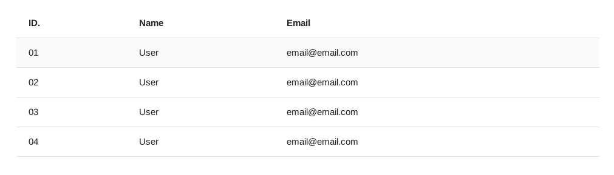
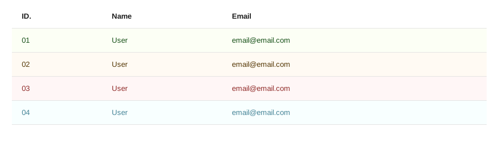
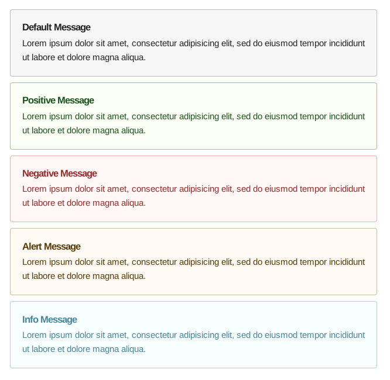
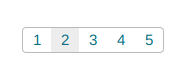

# Skeleton Extended
__WORK IN PROGRESS__

# Credit
All credit goes to the original creators of Skeleton CSS. Without their excellent work this project would not be possible.

Show them some love 
* [Website](http://getskeleton.com/)
* [Github](https://github.com/dhg/Skeleton/)

# Features and Changes
#### Event Colors

#### Buttons

#### Navigation Bar

#### Tables

#### Tables with Event Colors

#### Messages with Event Colors

#### Page Buttons

# TODO
* Fix the Navigation Bar for smaller screens
* Whole lot of testing
