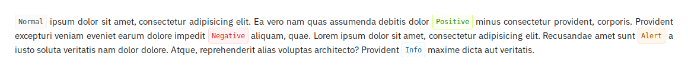
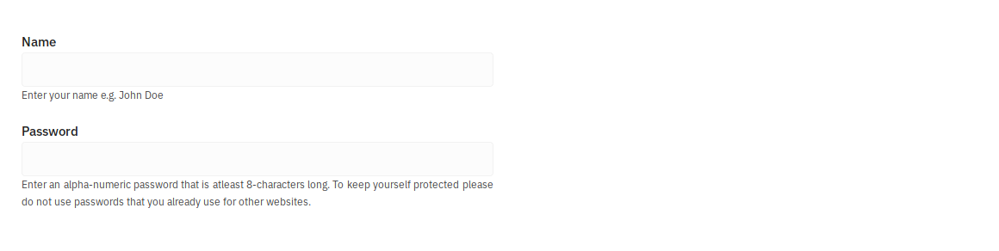
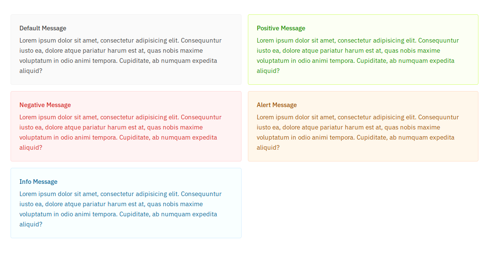

# Skeleton Extended
Skeleton CSS is great but it is missing quite a few things. This is where this project comes into the picture. Elements have been added that I felt were missing from the Skeleton CSS. This project is very much a **Work in Progress**.

# Credit
All credit goes to the original creators of Skeleton CSS. Without their excellent work this project would not be possible.

Show them some love
* [Website](http://getskeleton.com/)
* [Github](https://github.com/dhg/Skeleton/)

# Features and Changes
## Event Colors
Event colors can be applied to various elements. They style the border, background and font colors.


## Tags

```css
<span class="tag">Normal</span>
<span class="positive tag">Normal</span>
<span class="negative tag">Normal</span>
<span class="alert tag">Normal</span>
<span class="info tag">Normal</span>
```

## Field Descriptions

```css
<form>
  <label for="name">Name</label>
  <input class="u-full-width" type="text" name="name">
  <p>Enter your full name e.g. John Smith</p>
  <label for="password">Password</label>
  <input class="u-full-width" type="password" name="password">
  <p>Enter an alpha-numeric password that is atleast 8-characters long</p>
  <br>
  <input class="button-primary" type="submit" value="Login">
</form>
```

## Tables

```css
<table class="u-full-width">
  <thead>
    <tr>
      <th>ID.</th>
      <th>Name</th>
      <th>Email</th>
    </tr>
  </thead>
  <tbody>
    <tr>
      <td>01</td>
      <td>User</td>
      <td>email@emai.com</td>
    </tr>
    <tr>
      <td>02</td>
      <td>User</td>
      <td>email@emai.com</td>
    </tr>
    <tr>
      <td>03</td>
      <td>User</td>
      <td>email@emai.com</td>
    </tr>
    <tr>
      <td>04</td>
      <td>User</td>
      <td>email@emai.com</td>
    </tr>
  </tbody>
</table>
```

### Tables with Event Colors

```css
<table class="u-full-width">
  <thead>
    <tr>
      <th>ID.</th>
      <th>Name</th>
      <th>Email</th>
    </tr>
  </thead>
    <tbody>
     <tr class="positive">
       <td>01</td>
       <td>User</td>
       <td>email@emai.com</td>
     </tr>
     <tr class="alert">
       <td>02</td>
       <td>User</td>
       <td>email@emai.com</td>
     </tr>
     <tr class="negative">
       <td>03</td>
       <td>User</td>
       <td>email@emai.com</td>
     </tr>
     <tr class="info">
       <td>04</td>
       <td>User</td>
       <td>email@emai.com</td>
     </tr>
   </tbody>
</table>
```

## Messages with Event Colors

```css
<div class="message">
  <header>Default Message</header>
  <p>... </p>
</div>
<div class="positive message">
  <header>Positive Message</header>
  <p>... </p>
</div>
<div class="negative message">
  <header>Negative Message</header>
  <p>... </p>
</div>
<div class="alert message">
  <header>Alert Message</header>
  <p>... </p>
</div>
<div class="info message">
  <header>Info Message</header>
  <p>... </p>
</div>
```

## Page Buttons

```css
<div class="page-buttons">
  <a>1</a>
  <a class="active">2</a>
  <a>3</a>
  <a>4</a>
  <a>5</a>
</div>
```

## Navigation Bar

```css
<nav>
  <a class="active">Home</a>
  <a>Products</a>
  <a>Services</a>
  <a>Programs</a>
</nav>
```

### Navigation Bar Responsive


## Gallery

```css
<div class="gallery">
  <div class="item">
    
  </div>
  <div class="item">
    
  </div>
</div
```


# TODO
- [x] Inline Tags
- [ ] Inline Badges / counters
- [x] Input Field Descriptions
- [x] Checkboxes / Toggles
- [x] Date Fields
- [ ] Content Alignment
- [x] Hover Transitions
- [x] Port to SASS
- [ ] New Grid System
- [ ] Dark Theme
- [ ] Code Clean Up
- [ ] Testing, testing and testing!
