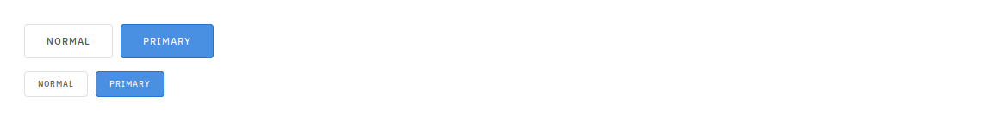

# Feather CSS
Feather CSS is a natural successor to Skeleton-CSS, which is great but was missing quite a few things. On top it that Skeleton-CSS hasn't been in active development since 2015.

Feather-CSS strinctly follows the philosophy set by Skeleton-CSS. It is dead simple to implement and the developers using it can get away with using simple HTML markup for most part. There is no need for crazy div & element nesting required by e.g. Bootstrap.

When the markup is clean, greater focus can be directed towards implementing the required business logic. There should be no feeling of fighting the underlying technology for achieving our ends.

If all that sounds good then you may like Feather-CSS. Do note that this project is still very much a **Work in Progress** and your mileage may vary. I'm still experimenting with what features should be included and how they should be implemented.

# Credit
* Original creators of Skeleton CSS. Without their excellent work this project would not be possible. [Website](http://getskeleton.com/)
* Mike Abbink, creator of the font IBM Plex Sans. [Website](https://www.ibm.com/plex/)

# Features and Changes
## Margins and Paddings
Margins and Paddings can be added to elements conveniently using these special classes

| Margins               |                          | Padding              |                           |
|-----------------------|--------------------------|----------------------|---------------------------|
| .margin-xx            | Margin on all sides      | .padding-xx          | Padding on all sides      |
| .margin-vertical-xx   | Margin on Top and Bottom | .padding-vertical-xx | Padding on Top and Bottom |
| .margin-horizontal-xx | Margin on Left and Right | .padding-vertical-xx | Padding on Left and Right |
| .margin-top-xx        | Margin on Top            | .padding-top-xx      | Padding on Top            |
| .margin-bottom-xx     | Margin on Bottom         | .padding-bottom-xx   | Padding on Bottom         |

**Note**: xx takes values 0 to 5, big and huge.

## Event Colors
Event colors can be applied to various elements. They style the border, background and font colors.


## Tags

```html
<span class="tag">Normal</span>
<span class="positive tag">Normal</span>
<span class="negative tag">Normal</span>
<span class="alert tag">Normal</span>
<span class="info tag">Normal</span>
```

## Field Descriptions

```html
<form>
  <fieldset>
    <label for="name">Name</label>
    <input type="text" name="name">
    <p>Enter your full name e.g. John Smith</p>
  </fieldset>
  <fieldset>
    <label for="password">Password</label>
    <input type="password" name="password">
    <p>Enter an alpha-numeric password that is atleast 8-characters long</p>
  </fieldset>
</form>
```

## Tables

```html
<table class="full-width">
  <thead>
    <tr>
      <th>ID.</th>
      <th>Name</th>
      <th>Email</th>
    </tr>
  </thead>
  <tbody>
    <tr>
      <td>01</td>
      <td>User</td>
      <td>email@emai.com</td>
    </tr>
    <tr>
      <td>02</td>
      <td>User</td>
      <td>email@emai.com</td>
    </tr>
    <tr>
      <td>03</td>
      <td>User</td>
      <td>email@emai.com</td>
    </tr>
    <tr>
      <td>04</td>
      <td>User</td>
      <td>email@emai.com</td>
    </tr>
  </tbody>
</table>
```

**Note**: Event colors can be applied to table rows
```html
<tr class="positive">
  ...
</tr>
```

## Messages

```html
<div class="message">
  <header>Default Message</header>
  <p>... </p>
</div>
<div class="positive message">
  <header>Positive Message</header>
  <p>... </p>
</div>
<div class="negative message">
  <header>Negative Message</header>
  <p>... </p>
</div>
<div class="alert message">
  <header>Alert Message</header>
  <p>... </p>
</div>
<div class="info message">
  <header>Info Message</header>
  <p>... </p>
</div>
```

### Flash Message

```html
<div class="flash-message alert">
  <div class="container">
    <p>This is a Flashed Message</p>
  </div>
</div>
```
**Note**: Event colors can be applied to the Flash Messages


## Page Buttons

```html
<div class="page-buttons">
  <a>1</a>
  <a class="active">2</a>
  <a>3</a>
  <a>4</a>
  <a>5</a>
</div>
```

## Navigation Bar

```html
<nav>
  <div class="logo">
    <h3>Company Name</h3>
  </div>
  <div class="links">
    <a href="#" class="active">Home</a>
    <a href="#">Products</a>
    <a href="#">Services</a>
    <a href="#">Programs</a>
  </div>
</nav>
```

## Gallery

```html
<div class="gallery">
  <div class="item">
    
  </div>
  <div class="item">
    
  </div>
</div
```

## Blockquotes

```html
<blockquote>
  <p>This is an Important Blockquote.</p>
</blockquote>
```

## Buttons

```css
<button>Normal</button>
<button class="button-primary">Primary</button>
<button class="button-thin">Normal</button>
<button class="button-primary button-thin">Primary</button>
```

## Switches

```html
<fieldset>
  <input type="checkbox" id="switch">
  <label for="switch">Remember Me</label>
</fieldset>
```

## Input Errors

```html
<fieldset class="input-error">
  <label for="name">Name</label>
  <input type="text" name="name">
  <p>Enter your name e.g. John Doe</p>
</fieldset>
```

# Bugs
- [ ] Inline tag font size in Firefox is wrong
- [ ] Select menu arrow is blue for some reason
- [ ] Date field arrows are wrong
- [x] Sticky isn't really sticky


# TODO
- [x] Inline Tags
- [x] Input Field Descriptions
- [x] Blockquotes
- [x] Input Date
- [x] Checkboxes
- [ ] File Upload Field
- [ ] Content Alignment
- [x] Hover Transitions
- [x] Port to SASS
- [x] New Grid System
- [ ] Dark Theme
- [ ] Reduce Code (Keep Under 1000 SLOC compiled)
- [ ] Testing, testing and testing!
