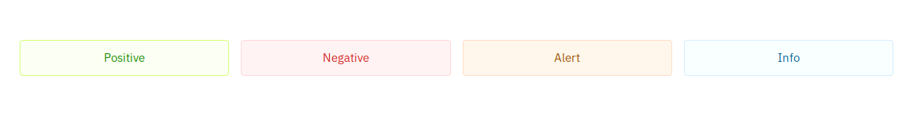
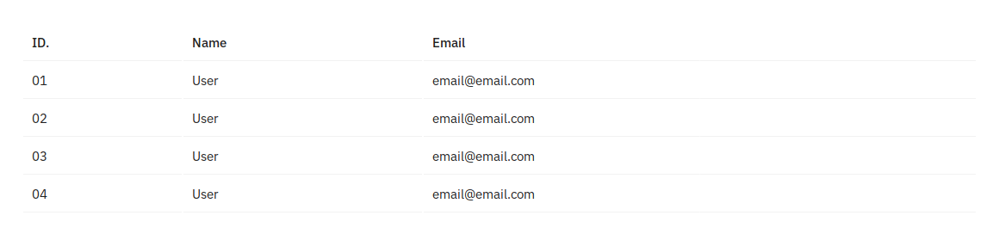

# Feather CSS
Feather CSS is a natural successor to Skeleton-CSS, which is great but was missing quite a few things. On top it that Skeleton-CSS hasn't been in active development since 2015. 

Feather-CSS strinctly follows the philosophy set by Skeleton-CSS. It is dead simple to implement and the developers using it can get away with using simple HTML markup for most part. There is no need for crazy div & element nesting required by e.g. Bootstrap. 

When the markup is clean, greater focus can be directed towards implementing the required business logic. There should be no feeling of fighting the underlying technology to achieve our ends.

if all that sounds good then you may like Feather-CSS. Do note that this project is still very much a **Work in Progress** and your mileage may vary.

# Credit
All credit goes to the original creators of Skeleton CSS. Without their excellent work this project would not be possible. Show them some love
  * [Website](http://getskeleton.com/)
  * [Github](https://github.com/dhg/Skeleton/)

# Features and Changes
## Event Colors
Event colors can be applied to various elements. They style the border, background and font colors.


## Margins and Paddings
Margins and Paddings can be added to elements conveniently using these special classes

| Margins               |                          | Padding              |                           |
|-----------------------|--------------------------|----------------------|---------------------------|
| .margin-xx            | Margin on all sides      | .padding-xx          | Padding on all sides      |
| .margin-vertical-xx   | Margin on Top and Bottom | .padding-vertical-xx | Padding on Top and Bottom |
| .margin-horizontal-xx | Margin on Left and Right | .padding-vertical-xx | Padding on Left and Right |
| .margin-top-xx        | Margin on Top            | .padding-top-xx      | Padding on Top            |
| .margin-bottom-xx     | Margin on Bottom         | .padding-bottom-xx   | Padding on Bottom         |

**Note**: xx takes values between 0 and 5 inclusive.

## Tags

```css
<span class="tag">Normal</span>
<span class="positive tag">Normal</span>
<span class="negative tag">Normal</span>
<span class="alert tag">Normal</span>
<span class="info tag">Normal</span>
```

## Field Descriptions

```css
<form>
  <fieldset> 
    <label for="name">Name</label>
    <input class="u-full-width" type="text" name="name">
    <p>Enter your full name e.g. John Smith</p>
  </fieldset>
  <fieldset>
    <label for="password">Password</label>
    <input class="u-full-width" type="password" name="password">
    <p>Enter an alpha-numeric password that is atleast 8-characters long</p>
    <input class="button-primary" type="submit" value="Login">
  </fieldset>
</form>
```

## Tables

```css
<table class="u-full-width">
  <thead>
    <tr>
      <th>ID.</th>
      <th>Name</th>
      <th>Email</th>
    </tr>
  </thead>
  <tbody>
    <tr>
      <td>01</td>
      <td>User</td>
      <td>email@emai.com</td>
    </tr>
    <tr>
      <td>02</td>
      <td>User</td>
      <td>email@emai.com</td>
    </tr>
    <tr>
      <td>03</td>
      <td>User</td>
      <td>email@emai.com</td>
    </tr>
    <tr>
      <td>04</td>
      <td>User</td>
      <td>email@emai.com</td>
    </tr>
  </tbody>
</table>
```

### Tables with Event Colors

```css
<table class="u-full-width">
  <thead>
    <tr>
      <th>ID.</th>
      <th>Name</th>
      <th>Email</th>
    </tr>
  </thead>
    <tbody>
     <tr class="positive">
       <td>01</td>
       <td>User</td>
       <td>email@emai.com</td>
     </tr>
     <tr class="alert">
       <td>02</td>
       <td>User</td>
       <td>email@emai.com</td>
     </tr>
     <tr class="negative">
       <td>03</td>
       <td>User</td>
       <td>email@emai.com</td>
     </tr>
     <tr class="info">
       <td>04</td>
       <td>User</td>
       <td>email@emai.com</td>
     </tr>
   </tbody>
</table>
```

## Messages with Event Colors

```css
<div class="message">
  <header>Default Message</header>
  <p>... </p>
</div>
<div class="positive message">
  <header>Positive Message</header>
  <p>... </p>
</div>
<div class="negative message">
  <header>Negative Message</header>
  <p>... </p>
</div>
<div class="alert message">
  <header>Alert Message</header>
  <p>... </p>
</div>
<div class="info message">
  <header>Info Message</header>
  <p>... </p>
</div>
```

## Page Buttons

```css
<div class="page-buttons">
  <a>1</a>
  <a class="active">2</a>
  <a>3</a>
  <a>4</a>
  <a>5</a>
</div>
```

## Navigation Bar

```css
<nav>
  <a class="active">Home</a>
  <a>Products</a>
  <a>Services</a>
  <a>Programs</a>
</nav>
```

### Navigation Bar Responsive


## Gallery

```css
<div class="gallery">
  <div class="item shadow-large">
    
  </div>
  <div class="item shadow-large">
    
  </div>
</div
```


# TODO
- [x] Inline Tags
- [ ] Inline Badges / counters
- [x] Input Field Descriptions
- [ ] Blockquotes
- [x] Input Date
- [x] Checkboxes
- [ ] Content Alignment
- [x] Hover Transitions
- [x] Port to SASS
- [x] New Grid System
- [ ] Dark Theme
- [ ] Code Clean Up
- [ ] Testing, testing and testing!
